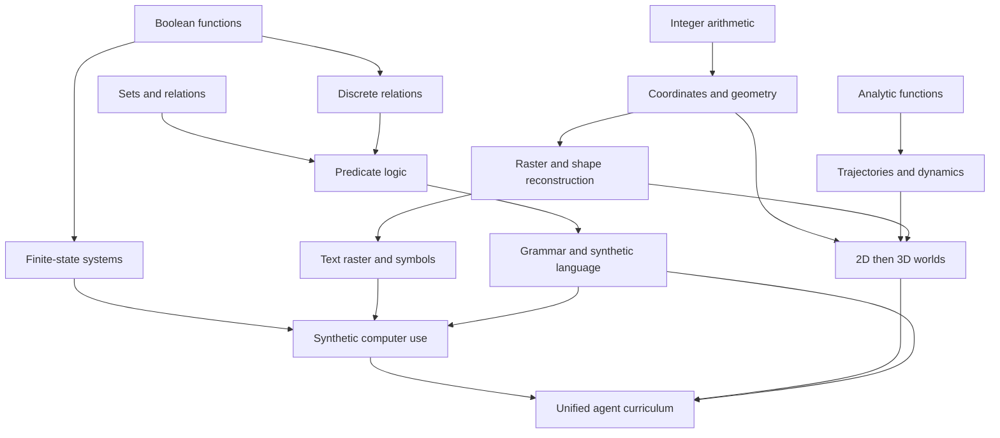

# TCN: constitutional architecture

**Constitutional specification · 2026-09-08 · implemented reference system.**

See [implementation choices](docs/IMPLEMENTATION.md) and
[measured validation](docs/VALIDATION.md) for concrete behavior and limits.

TCN is a typed differentiable program synthesizer with hierarchical supervision
and progressive crystallization. It learns transformations from fully synthetic
transition systems, then composes frozen transformations into larger programs.
Low cost and latency must be demonstrated at useful end-to-end capability.

**No domain receives a computational primitive unavailable in principle to every
other domain. Anything plausibly learnable as a reusable transformation must not
be silently implemented as preprocessing.**

## 1. Type algebra

The exact data algebra starts with:

```text
T := bool | int[n] | set[T] | tuple[T1, ..., Tk]
```

`int[n]` is a finite-width integer carrier with explicit interpretation. Sets
are finite, unordered, and duplicate-free; tuples are ordered products. Execution
capacities, overflow, equality, and invalid-value behavior must be specified.
The empty tuple supplies unit. Sequences are indexed values plus length;
relations are sets of tuples. Time series add temporal coordinates, clock/rate,
and availability. Neither sequences nor time series require another substrate.

Keep **semantic type**, **representation**, and **operator** separate. Semantic
schemas refine carriers with meaning, units, coordinate frames, and constraints.
Representations specify signedness, width, fixed-point scale, or floating-point
encoding. Continuous quantities use declared numeric encodings over the same
carriers; analytic operators act on their decoded numeric meaning. There is no
implicit reinterpretation of a category ID as a scalar measurement.

A carrier's semantic role is therefore one of three classes, and the class, not
the width, decides which operators apply. A **magnitude** is a scalar
measurement: ordering, arithmetic, aggregation and mixtures denote. A **nominal**
identifier is unordered: only equality denotes, averaging two of them denotes
nothing, and a relaxation gives it a categorical rather than a scalar lift. An
**uncommitted** carrier is a raw unit off a channel — a pixel channel, a text
octet, a file octet, an audio sample — whose interpretation has not been
declared. It is not a third kind of number; it is the absence of a declaration,
and it is restricted to exactly what holds for either reading, which is equality,
indexing and structure. A generator that knows its values are labels declares
them nominal at the source, and no later operation may undo that.

Committing an uncommitted carrier is an explicit graph operation with a declared
conversion/error contract, in one direction only. The commitment preserves the
carrier bit-for-bit — same width, encoding, unit, frame and bounds — and changes
only the declared meaning, so its error is exactly zero and it is invertible in
value though not in permission. What is forbidden is the *implicit*
reinterpretation and the *reverse* one: there is no conversion from a nominal
identifier to a magnitude at any width, and none from a magnitude back to an
uncommitted carrier. A program that treats a pixel as an intensity therefore
carries that claim visibly in its exported text, where it can be read off and
falsified by the data, instead of smuggling it through a bit-level
reinterpretation.

Training may lift an encoding into continuous coordinates, bit probabilities,
or categorical distributions. Each lift declares embedding, valid relaxation,
mixing, and hard decoding. Set relaxations must respect permutation invariance
and state their membership/cardinality treatment. Continuous relaxation is a
training mechanism, not a change in the value's semantic role.

Representation changes are explicit graph operations. Changing a scalar from
floating encoding to scaled `int[12]` preserves its role only through a declared
conversion/error contract. Capacity and precision changes cannot silently alter
an existing module interface. Images, symbols, entities, and other domain labels
are composed schemas or probe targets, not new irreducible data types.

## 2. Operator algebra

An operator is a typed mapping `(T1, ..., Tk) -> U`, with exact semantics,
representation requirements, parameter domains, and a declared derivative,
training relaxation, or nondifferentiable boundary. Randomness is an explicit
input. Stateful operations expose state input/output. Each operator has one
versioned contract, conformance cases, and a cost description.

| Family | Initial candidates |
|---|---|
| Logic | `not`, `and`, `or`, `xor`, `mux`, equality, comparisons |
| Integer/discrete | `+`, `-`, `*`, `div/mod`, `min/max`, `abs`, shifts |
| Analytic | `+`, `-`, `*`, `/`, `pow`, `exp`, `log`, `sin`, `cos`, `atan2`, `sqrt` |
| Aggregation | `sum`, `mean`, `min`, `max`, `count` |
| Set/structure | membership, insert/remove, selection, pair/join, indexing/projection |
| Temporal | delay, difference, accumulation |
| Spectral | Fourier basis/transform, inverse transform |
| Representation | encode/decode, quantize/dequantize, pack/unpack, interpret |

`interpret` is the section 1 commitment as an operator: one input, one declared
output type, the same carrier and the same encoding, and only the `role` moves,
from uncommitted to magnitude or to nominal. It is the sole exit from an
uncommitted role and it has no inverse. Its gradient is not a free choice but a
consequence of the relaxation each committed class already declares. Committing
to a magnitude keeps the same single-scalar lift the uncommitted carrier had, so
the relaxation is the identity, the derivative is one, and a gradient crosses the
commitment. Committing to a nominal identifier moves to a categorical lift of a
different width, and no derivative from a magnitude into unordered bits is valid,
so that commitment is exact at an explicit gradient boundary. Both commitments
are exact in the forward direction; only one of them is differentiable, and which
one is decided by the semantics rather than by convenience.

This is a small candidate inventory, not permission for opaque helpers. `map`
and `filter` require an explicit subprogram; joins name their matching rule;
encode/decode name a representation. Numeric domains, overflow, division by
zero, and Fourier normalization/axes are defined, not silently patched. Temporal
and spectral operations must respect sample availability. A candidate without a
valid relaxation remains an exact operator at an explicit gradient boundary.

Connected components, edge detectors, tokenizers, objects, words, windows, and
buttons are not initial learned primitives. Richer transformations are composed
or learned. A generator may implement these concepts to create worlds and exact
labels; that does not grant the agent a corresponding built-in operation or
preprocessed input. Generator/evaluator code and the admissible synthesis library
have an explicit boundary. Every learned domain uses the same operator registry;
curriculum stages may select typed subsets without private domain-only opcodes.

## 3. Node semantics

A node learns a distribution over legal operator applications. Candidate input
bindings are drawn from bounded predecessor pools; full signatures must unify,
including arity, input/output types, representations, shapes, and refinements.
Impossible candidates never enter normalization; an empty set is an error.

```text
K_v = legal operator-and-input-binding candidates for node v
p_v = softmax(logits_v / temperature_v) over K_v
output_v = declared type-preserving mixture of relaxed candidate outputs
```

All mixed outputs share a type and compatible relaxation. Thus scalar arithmetic
and scalar comparisons occupy different output slots, even when their inputs
match. A unary sine cannot consume a binary signature. Conversion nodes compete
only where their full signatures fit; learning may choose conversion placement
and routing within the scaffold without mixing incompatible values.

Every evaluated candidate must be defined over its relaxed inputs. Masking a
NaN after evaluating an invalid logarithm is insufficient. Unordered IDs cannot
be averaged as numbers. Refined nonconvex domains need a valid lift/projection
or a discrete boundary. These restrictions make typing a search prior, not a
runtime penalty.

## 4. Graph and module semantics

A graph connects typed nodes. Within a tick it is a DAG; recurrence reads old
state and commits new state through explicit delays. Represented relations may
be cyclic. Curriculum prerequisites form a different DAG.

A module is a graph plus typed interface. The supplied coarse structure defines
admissible regions, predecessor pools, capacities, and boundary placements.
Inputs and outputs can occur at different depths; region names do not assert a
universal ordering of abstractions. Fine operator choices, wiring, parameters,
and reusable module selection are learned within this structure.

A crystallized module is an immutable, versioned, discrete callable program with
**no internal gradients**. Register it as one typed candidate operator for later
synthesis: this is recursive abstraction. Its internal description, precision,
latency, and storage still count toward complexity/cost; a call is not free.
Sharing counts a module definition once plus its call sites, with execution cost
charged per use. What is registered and exported is the program, not the scaffold
it was found in: nodes that cannot reach an output or a state update are dropped
first, since a dead gate kept from the search space would otherwise be charged
transitively at every call site for the life of the module. Pruning preserves
exact semantics and changes the content address.
Relearning creates a new version and revalidates dependents.
Matching interfaces includes semantic meaning, not merely matching array sizes.

## 5. Crystallization algorithm

Crystallization is a scheduler with separate controls for choice concentration,
hard execution, and numeric precision. Start from an input/output boundary
preference and progress inward, allowing confidence and stability to override
strict depth order.

1. Train the soft graph and measure candidate entropy, selection stability,
   probe/task loss, and gradient availability.
2. Gradually concentrate candidate choices and introduce the intended encoding
   or precision pressure. Snapshot the graph and optimizer state.
3. Temporarily harden a candidate node/block and measure degradation.
4. Retrain the residual soft graph around that hard block.
5. Freeze only if degradation remains within declared thresholds across relevant
   objectives and interfaces, and exact/exported executions conform.
6. Otherwise restore the snapshot and defer/retrain; repeat until the program
   is crystallized or the stated budget is exhausted.

A hard-forward trial can use a named surrogate, with forward and backward
behavior checked separately. Freezing removes that internal gradient machinery.
At the frozen callable boundary, gradients stop. Remaining trainable regions
need their own probe/objective or another valid gradient path; otherwise defer
freezing. Outside-in freezing must never silently disconnect all learning signal
to the interior. Frozen blocks can supply forward values and targets to later
training without becoming differentiable again.

Discrete program selection does not require one-bit numeric values. Fixed
floating or scaled-integer arithmetic can remain in the export. All learned
choices/parameters eventually freeze; evolving episode memory and explicit
runtime randomness remain live. Temperature, thresholds, stability windows,
block size, and precision are experiment configuration, not settled constants.

## 6. Homogeneous generator interface

All data generators are siblings under `generators/<name>/`, with one contract:

```text
initialize(address, configuration) -> state
step(state, typed_actions, dt, random_input) -> next_state, step_record

step_record:
  observations, actions, latent_states, probes,
  available_actions, transition, reward_components, metadata
episode:
  versioned specification + ordered step_records
```

Initialization also provides the initial observation/probe record. Stateless and
passive generators use unit state/actions as appropriate. Fields carry typed
values, timestamps, and visibility declarations; transitions are typed records
of what changed, not arbitrary code passed through metadata. A shared host
supports sampling, stepping, composition, recording, and replay.

The actor receives only permitted observations, objective descriptions, and
observable action opportunities. Latents, desired probes, authoritative hidden
preconditions, and evaluator metadata remain separate training/audit channels.
Unknown preconditions can cause an observable failed attempt; an oracle action
menu is an explicitly easier setting. A seed or object ordering can leak truth
as readily as a target tensor.

Replaying requires pinned generator/configuration versions, explicit random
streams, logical clocks, complete state restoration, and recorded exogenous
inputs. Declare numerical reproducibility limits. All content is synthetic;
generated language and images are projections of known state/programs. The
terminal embodied world is another generator composing earlier mechanisms.
Per-domain input APIs, hidden preprocessing, and special trainer loops are
outside this contract.

## 7. Supervision interface

Curriculum-provided admissible interfaces are explicit configuration records:

```text
signal:
  source, target_or_probe, allowed_graph_region,
  semantic_type, representation, time_alignment, visibility, loss
```

An input supplies a permitted value. A probe reads an internal value for
supervision. A target must not accidentally become an input or a teacher-forced
hidden-state replacement. These bindings support hierarchical supervision at
multiple regions without equating abstraction with layer number.

Exact generator state enables rich optional labels; it does not make hidden
truth identifiable from an agent's observations. Use deterministic targets where
history determines them, and conditional distributions, equivalence classes, or
unknown masks elsewhere. Multiple inverse renderings can be valid. Reserve
unspecified latent capacity instead of forcing every useful abstraction into
permanent named coordinates. Probe performance must be checked against causal
use and downstream behavior, not just readout accuracy.

## 8. Loss composition

During integrated training, next-latent prediction and policy reinforcement are
both active, across a declared distribution of observable objectives `g`:

```text
L = lambda_pred    * L_future_latents
  + lambda_probe   * L_intermediate
  + lambda_policy  * L_RL
  + lambda_mdl     * L_program_description
  + lambda_crystal * L_discreteness
```

Predict several future latent fields/horizons, conditioned on history, executed
actions, and elapsed time. Use type-appropriate losses and normalize field/goal
scales. Synthetic truth initially anchors latent meanings; a learned target
encoder additionally needs explicit stabilization and anti-collapse controls.
Stochastic or occluded state requires distributional prediction.

`L_RL` includes the specified actor/value estimation and exploration terms,
using actual synthetic rollouts initially. The environment need not be
differentiable. Rewards determine task utility; prediction supplies dense signal.
Track actual return and gradient conflicts because a weighted sum does not
guarantee alignment. Program-description cost includes frozen library modules.
`L_program_description` is description length, not execution cost: the expected
serialized size of the pruned program under the current choice distribution, with
each distinct module definition charged once and every call site charged
individually. It is a distinct term from the execution-cost sum, which a module
call and its inlined body pay equally, and it is exact at any discrete selection.
Type errors are impossible by construction; a penalty may address numerical
relaxation consistency but never buy permission for illegal wiring.

## 9. Curriculum DAG and validation



Stages specify generator/objective distributions, admissible interfaces,
trainable modules, prerequisites, and evidence gates. Ready branches train
independently; joins test interface meaning, retained capability, and joint
fine-tuning. Crystallization occurs throughout, not only after the last stage.

Hold out generating structures, grammar/representation combinations, goals, and
horizons as well as seeds; keep all views of an episode together. Separate
tuning/crystallization validation from final tests. Compare exact references and
matched-information baselines; measure learning curves, closed-loop success,
probe ablations, composition retention, hardening loss, and complete-path
cost/memory/batch-one latency. Preregister thresholds and budgets per experiment.
Replay/type correctness, learning, and useful exported behavior are separate
gates. Synthetic success does not establish natural-data transfer; evaluate that
later before making real-world capability claims.
